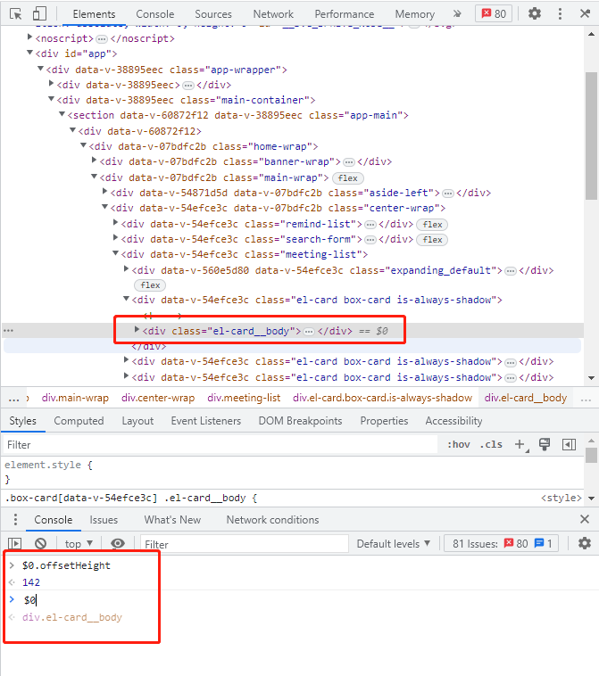
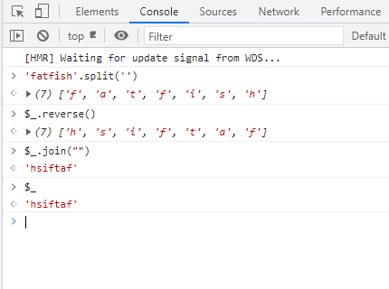
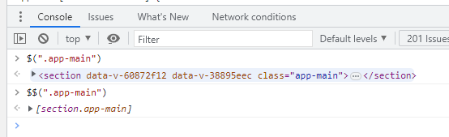
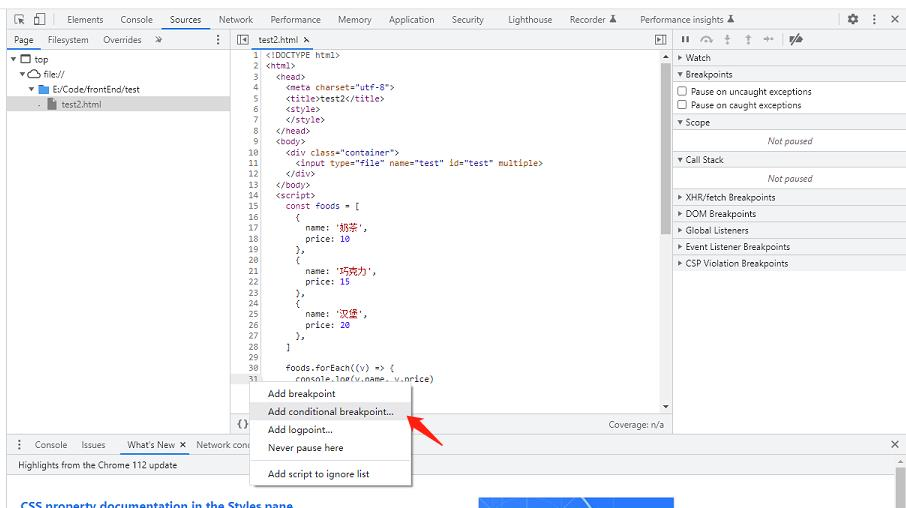
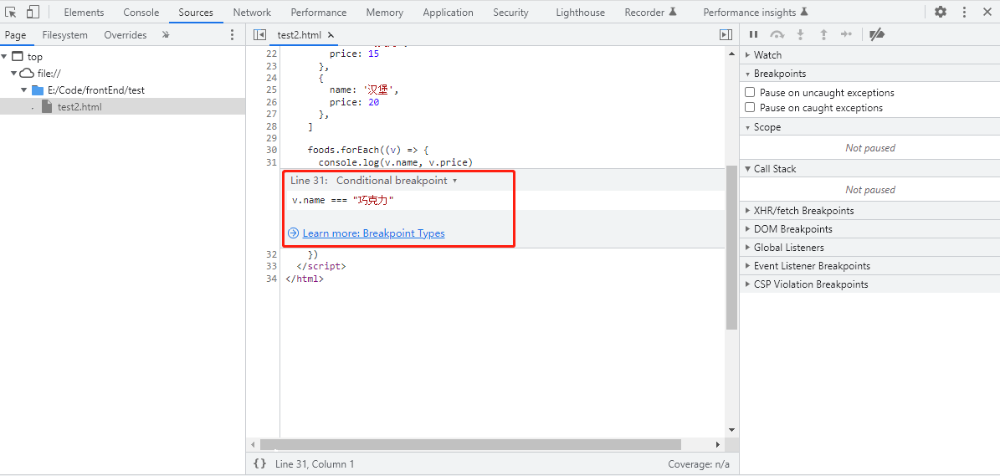
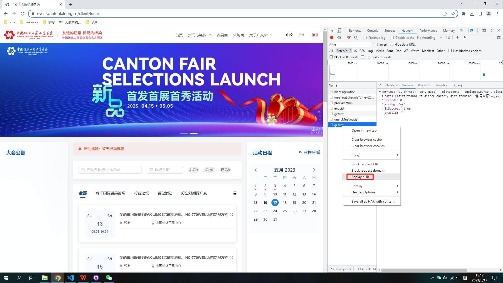
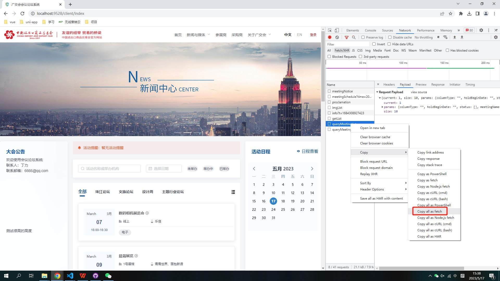
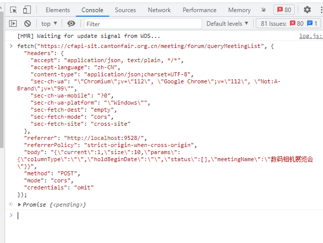
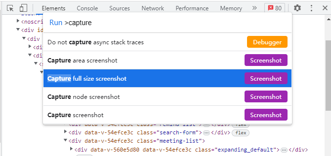

# chrome调试技巧

## Elements

### 一键展开所有 DOM 元素

调试元素时，在层级比较深的情况下，你是不是也经常一个个展开去调试？有一种更加快捷的方式

1. 按住 alt 键 + click（需要展开的最外层元素）

## Console

### 控制台获取 Elements 面板选中的元素

调试网页时通过 ``Elements`` 面板选中元素后，如果想通过JS知道它的一些属性，如宽、高、位置等怎么办呢？

1. 通过 ``Elements`` 选择要调试的元素
2. 控制台直接用 ``$0`` 访问



### 控制台引用上一次执行的结果

调试的过程中，你经常会通过打印查看一些变量的值，但如果你想看一下上次执行的结果呢？再输一遍表达式吗？

这时候 ``$_`` 就派上了用场，``$_`` 是对上次执行的结果的 引用：



### "$"和"$$"选择器

在控制台使用 ``document.querySelector`` 和 ``document.querySelectorAll`` 选择当前页面的元素是最常见的需求了，不过着实有点太长了，咱们可以使用 ``$`` 和 ``$$`` 替代。



## Sources

### Add conditional breakpoint条件断点的妙用

假设有下面这段代码，咱们希望食物名字是 巧克力 时才触发断点，可以怎么弄？

```js
const foods = [
  {
    name: '奶茶',
    price: 10
  },
  {
    name: '巧克力',
    price: 15
  },
  {
    name: '汉堡',
    price: 20
  },
]

foods.forEach((v) => {
  console.log(v.name, v.price)
})
```

1. 选中 Sources
2. 右击需要断点调试行
3. 选择 Add conditional breakpoint
4. 输入条件





## Network

### 一键重新发起请求

在与后端接口联调或排查线上BUG时，经常遇到需要再次发起一次请求的情况

重发请求，这有一种简单到发指的方式。

1. 选中 ``Network``
2. 点击 ``Fetch/XHR``
3. 选择要重新发送的请求
4. 右键选择 ``Replay XHR``



### 在控制台快速发起请求

还是联调或修BUG的场景，针对同样的请求，有时候需要修改入参重新发起，有啥快捷方式？

1. 选中 ``Network``
2. 点击 ``Fetch/XHR``
3. 选择 ``Copy as fetch``
4. 控制台粘贴代码
5. 修改参数，回车搞定





## Command 命令

### 截屏

有时会有对网页截屏的需求，一屏还好，系统自带的截屏或者微信截图等都可以办到，但是要求将超出一屏的内容也截下来咋办呢？

1. 准备好需要截屏的内容
2. ``cmd + shift + p`` 执行 ``Command`` 命令
3. 输入 ``Capture full size screenshot`` 按下回车



**如果要截取选中的部分元素呢？**

答案也很简单，第三步输入 ``Capture node screenshot`` 即可