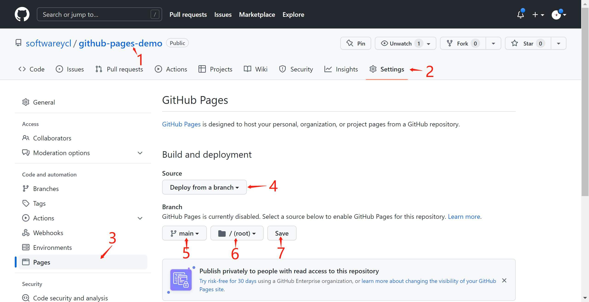

# Github Pages

[[toc]]

## 前言

在日常工作中, 我们经常会遇到要做 demo 展示的情况. 做 demo 展示不同于做项目开发, 我们需要的是快速轻便的开发和部署, 而不是完备的一整套开发流程。

尤其对于数据可视化工作, 能快速的创建一个 demo 来验证自己的想法, 并且方便的和同伴分享自己作品是非常重要的.

在这里介绍一种用来做 demo 的方法: Github Pages。

GitHub Pages 是通过 GitHub 托管和发布的公共网页，你可以使用 GitHub Pages 来展示一些开源项目、个人博客或者分享你的简历等。

## 选择 github pages 的理由

1. **使用零成本:** github pages 集成在 github 中, 直接和代码管理绑定在一起, 随着代码更新自动重新部署, 使用非常方便.
2. **免费:** 免费提供 username.github.io 的域名, 免费的静态网站服务器.
3. **无数量限制:** github pages 没有使用的数量限制, 每一个 github repository 都可以部署为一个静态网站.

## 关于 GitHub Pages

GitHub Pages 是一项静态站点托管服务，它直接从 GitHub 上的仓库获取 HTML、CSS 和 JavaScript 文件，（可选）通过构建过程运行文件，然后发布网站。

GitHub Pages 适用于具有 GitHub Free 和组织的 GitHub Free 的**公共仓库**，以及具有 GitHub Pro、GitHub Team、GitHub Enterprise Cloud 和 GitHub Enterprise Server 的**公共和私有仓库**。

## GitHub Pages 站点的类型

有三种类型的 GitHub Pages 站点：项目、用户和组织。 项目站点连接到 GitHub 上托管的特定项目，例如 JavaScript 库或配方集合。 用户和组织站点连接到 GitHub.com 上的特定帐户。

若要发布用户站点，必须创建名为 `<username>.github.io` 的个人帐户拥有的存储库。 若要发布组织站点，必须创建名为 `<organization>.github.io` 的组织帐户拥有的存储库。 除非使用的是自定义域，否则用户和组织站点在 `http(s)://<username>.github.io` 或 `http(s)://<organization>.github.io` 中可用。

项目站点的源文件与其项目存储在同一个仓库中。 除非使用的是自定义域，否则项目站点在 `http(s)://<username>.github.io/<repository>` 或 `http(s)://<organization>.github.io/<repository>` 中可用。

## GitHub Pages 站点的发布来源

源分支可以是存储库中的任何分支，源文件夹可以是源分支上的存储库根目录 (/)，也可以是源分支上的 /docs 文件夹。 将更改推送到源分支时，源文件夹中的更改将发布到 GitHub Pages 站点。

> 以前源分支只能是 gh-pages，源文件夹只能是根目录，所以网上资料很多提到创建发布到 gh-pages 的。

## 使用方法

### 一、部署静态网页

首先我们介绍一下部署最基础的静态网页, 最终的效果是展示出一个 Hello, github pages ！ 页面。
 
> [demo效果](https://softwareycl.github.io/github-pages-demo/)
> 
> [代码地址](https://github.com/softwareycl/github-pages-demo)

#### 创建一个github项目

前往 [github 官网](https://github.com), 点击 `New repository` 创建新项目. 填入项目基本信息, 点击 `Create Repository` 确认。

> 注意：仓库需要选择 `public` 公开，选择 `private` 无法部署GitHub Pages。


#### 编写代码

仓库 clone 到本地, 创建 `index.html` 文件，写好简单页面代码，提交代码到github。

GitHub Pages 默认访问根目录的 `index.html`，如果无法在其中找到 `index.html`，则会在页面上渲染 `README.md`。

```html
<!DOCTYPE html>
<html lang="en">
<head>
  <meta charset="UTF-8">
  <meta http-equiv="X-UA-Compatible" content="IE=edge">
  <meta name="viewport" content="width=device-width, initial-scale=1.0">
  <title>Document</title>
</head>
<body>
  <h1>Hello, github pages !</h1>
</body>
</html>
```

#### 为 repository 开启 github page 选项

1. 在 GitHub 上，导航到站点的仓库；
2. 在仓库菜单栏下，单击 ***Setting***；
3. 在侧边栏的 ***Code and automation*** 栏目下，单击 ***Pages***；
4. 在 ***Build and deployment*** 的 ***Source*** 下，选择 ***deploy from a branch***（默认选中）。
5. 在 ***Build and deployment*** 的 ***Branch*** 下，选择 ***项目任意分支*** 作为发布源，选择 ***None*** 表示关闭GitHub Pages
6. （可选）使用下拉菜单选择发布源的文件夹，可以选根目录 `(/(root))`，或者docs目录 `(/docs)`
7. 单击“ 保存”。



#### 效果图

保存后 Github Pages 部署需要时间，具体可点击 ***Actions*** 查看部署进度

部署完成后，***Pages*** 页会出现页面访问地址


打开链接，查看页面效果


### 二、使用前端框架时, 如何使用 github pages

如今我们创建一个前端项目的时候, 已经很少手动创建 index.html, main.js , main.css 这文件了, 通常我们都会选择一个前端框架, 并使用相应的脚手架来初始化项目。

#### 上传 github pages 的3种方案

1. 项目打包后，打包后的文件默认放在根目录的 `/dist` 文件夹下，将 `dist` 文件夹下的文件放到根目录下，上传到github。
2. 因为github可以读取 `/docs` 文件夹下的 `index.html`，可修改打包配置，将打包文件目录从 `/dist` 改为 `/docs`。
3. 通过脚本，自动打包，并自动把打包后 `/dist` 文件夹下面的内容推到 github 仓库中。

下面主要介绍**方案3**，并以 `vue2.x` 项目为例

#### 创建仓库

前往 github 官网，创建一个github项目，本项目命名为 `github-pages-vue-demo`，为 repository 开启 github page 选项

#### 创建项目

运行 `vue create` 命令创建项目

```sh
vue create github-pages-vue-demo
```

vue版本选择 ***2.x***


页面不部署在 `<username>.github.io` 仓库的，需要在 `vue.config.js` 中把 publicPath 改成对应仓库名，  本项目改成 `publicPath: '/github-pages-vue-demo'`

#### 编写自动打包上传脚本

编写自动打包上传脚本 `deploy.sh` (命名随意)，放到项目根目录下

```sh
#!/usr/bin/env sh

# 确保脚本抛出遇到的错误
set -e

# 生成静态文件
npm run build

# 进入生成的文件夹
cd dist

# 如果是发布到自定义域名
# echo 'www.example.com' > CNAME

git init
git add -A
git commit -m 'deploy'

# 如果发布到 https://<USERNAME>.github.io
# git push -f git@github.com:<USERNAME>/<USERNAME>.github.io.git master

# 如果发布到 https://<USERNAME>.github.io/<REPO>
# git push -f git@github.com:<USERNAME>/<REPO>.git master:gh-pages
git push -f git@github.com:softwareycl/github-pages-vue-demo.git master:main

cd -
```

运行 `deploy.sh` 脚本，成功后如下图所示


> [demo示例](https://softwareycl.github.io/github-pages-vue-demo/)

#### 

## 参考资料

[1. 使用 github pages, 快速部署你的静态网页](https://blog.csdn.net/baidu_25464429/article/details/80805237)

[2. GitHub Pages官方中文文档](https://docs.github.com/cn/pages)