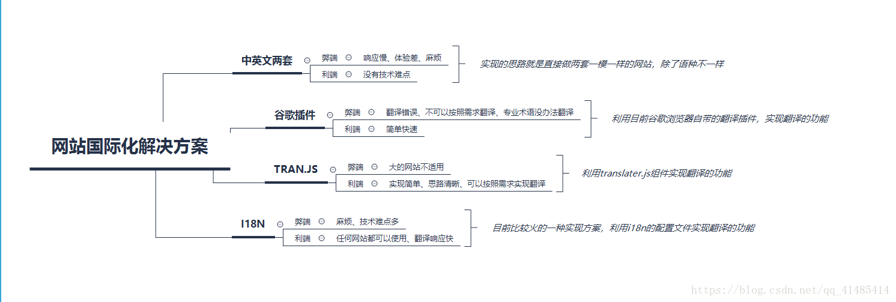

# Vue I18n

[[toc]]

## 四种前端国际化解决方法



### 第一种方式

针对不同的语言，各写一套界面，这个是最好解决，技术含量最低的一种办法，那么弊端也就很明显了，占内存大，麻烦；

### 第二种方式

引入谷歌的插件实现翻译的效果，优点是简单快速，弊端就是翻译不可控，可能把不需要翻译的内容翻译了，翻译也可能不准确，现在还可能会被墙；如何引入谷歌插件可以查看下面

[引入谷歌翻译](https://blog.csdn.net/ParadiserD/article/details/78320507)

### 第三种方式

使用 translater.js 实现翻译功能，利用 HTML 注释的页面翻译解决方案，少量的页面，这种方法没有问题。如果页面很多，需要写的注释就会很多；

```html
<button id="btn-addAlarmToEvent" type="button" class="btn btn-success">
  确定
  <!--{cn}确定-->
  <!--{en}Confirm-->
</button>
```

翻译的机制就是通过注释的语种来识别需要的语种的

### 第四种方式

I18N 实现国际化，这可能是网上说的最多的一个办法了，也是目前相对比较成熟的一个办法,优点是语言包形式统一管理，复用性强。缺点是配置文件配置复杂，可读性差。

## 下面主要介绍 Vue I18n(8.1.1 版本)

## 介绍

i18n（其来源是英文单词 internationalization 的首末字符 i 和 n，18 为中间的字符数）是“国际化”的简称。

Vue I18n 是 Vue.js 的国际化插件。它可以轻松地将一些本地化功能集成到你的 Vue.js 应用程序中。

## 安装使用

```
npm install vue-i18n
```

**注意：** vue2.x 版本需要装 8.x 版本以下，vue3.x 装 9.x 版本以上，若 vue2.x 版本装 9.x 以上会报以下错误

```
npm ERR! code ERESOLVE
npm ERR! ERESOLVE unable to resolve dependency tree
npm ERR!
npm ERR! While resolving: vue-i18n@0.1.0
npm ERR! Found: vue@2.7.8
npm ERR! node_modules/vue
npm ERR!   vue@"^2.6.14" from the root project
npm ERR!
npm ERR! Could not resolve dependency:
npm ERR! peer vue@"^3.0.0" from vue-i18n@9.2.2
npm ERR! node_modules/vue-i18n
npm ERR!   dev vue-i18n@"*" from the root project
```

引入 vue-i18n 并使用

```js
// src/i18n/index.js
import VueI18n from 'vue-i18n';
Vue.use(VueI18n);
```

配置语言包

```js
// src/i18n/langs/zh.js
// import zhLocale from "element-ui/lib/locale/lang/zh-CN"; // 导入element ui中的默认中文配置

const zh = {
  // 共通
  common: {
    // 按钮
    button: {
      save: '保存',
      confirm: '确定',
      cancel: '取消',
      goback: '返回',
      submit: '提交',
      query: '查询',
      reset: '重置',
      changeLanguage: '语言切换',
    },
    // 页面各模块标题
    title: {
      title1: 'Vue I18n国际化',
    },
    // 系统公共术语
    info: {},
  },

  // ...zhLocale
};
```

统一引入语言包

```js
// src/i18n/lang/index.js
import zh from './zh';
import en from './en';

export default {
  'zh-CN': zh,
  'en': en,
};
```

配置 vue-i18n

```js
// src/i18n/index.js
import message from './langs';

const i18n = new VueI18n({
  locale: localStorage.getItem('lang') || 'zh-CN', // 语言标识
  messages: {
    ...message,
  }, // 语言包信息
});
```

引入使用

```js
// main.js
import i18n from './i18n'; // 导入国际化配置

new Vue({
  render: (h) => h(App),
  i18n,
}).$mount('#app');
```

现在可以正常使用了，语法如下

```vue
<h1>{{ $t("common.title.title1") }}</h1>
```

## 用法

### 格式化

#### 具名格式

语言环境：

```js
message: {
  hello: '{msg} world!';
}
```

模板：

```vue
<p>{{ $t('common.message.hello', { msg: 'hello' }) }}</p>
```

输出：

```
hello world!
```

#### 列表格式

语言环境：

```js
message: {
  framework: 'front-end framework,{1}';
}
```

模板：

```vue
<p>{{ $t('common.message.framework', ['vue', 'react', 'Angular']) }}</p>
```

输出：

```
front-end framework,react
```

也可以传类数组对象:

```vue
<p>{{ $t('common.message.framework', {'0': 'vue', '1': 'react', '2': 'Angular'}) }}</p>
```

#### HTML 格式化

> 网站上动态插入任意 HTML 可能非常危险，因为它很容易导致 XSS 攻击。仅对可信内容使用 HTML 插值，而不对用户提供的内容使用。
>
> 建议使用**组件插值**功能

语言环境：

```js
message: {
  vHtml: 'Wrap <br> label';
}
```

模板：

```vue
<p v-html="$t('common.message.vHtml')"></p>
```

输出：

```
Wrap
label
```

### 复数

你可以使用复数进行翻译。你必须定义具有管道 | 分隔符的语言环境，并在管道分隔符中定义复数。

\*您的模板将需要使用 `$tc()` 而不是 `$t()`。

语言环境：

```js
message: {
  apple: 'no apples | one apple | {count} apples | four apples';
}
```

模板：

```vue
<p>{{ $tc('common.message.apple', 0) }}</p>
<p>{{ $tc('common.message.apple', 1) }}</p>
<p>{{ $tc('common.message.apple', 2, { count: 10 }) }}</p>
<p>{{ $tc('common.message.apple', 3, { count: 20 }) }}</p>
<!-- 错误用法 -->
<p>{{ $t('common.message.apple', 1) }}</p>
```

输出：

```
0 苹果
1 苹果
10 苹果
// 发现还是取第三个
20 苹果
0 苹果 | 1 苹果 | {count} 苹果 | 4 苹果
```

源码中，choice 即第二个参数，第二个参数大于 2 时取 2

```js
return choice ? Math.min(choice, 2) : 0;
```

#### 通过预定义的参数访问该数字

你无需明确指定复数的数字。可以通过预定义的命名参数 {count} 和/或 {n} 在语言环境信息中访问该数字。如有必要，你可以覆盖这些预定义的命名参数。

> 9.x 版本才能使用

### 日期时间本地化

[参考官方文档-日期时间本地化](https://kazupon.github.io/vue-i18n/zh/guide/datetime.html)

### 数字本地化

[参考官方文档-数字本地化](https://kazupon.github.io/vue-i18n/zh/guide/number.html)

### 语言环境信息的语法

#### 结构

```js
{
  "en": {  // 'en' Locale
    "key1": "this is message1", // 基本的
    "nested": { // 嵌套
      "message1": "this is nested message1"
    },
    "errors": [ // 数组
      "this is 0 error code message",
      {  // 数组嵌套对象
        "internal1": "this is internal 1 error message"
      },
      [  // 数组嵌套数组
        "this is nested array error 1"
      ]
    ]
  },
  "ja": { // 'ja' Locale
    // ...
  }
}
```

#### 链接本地信息

如果有一个翻译关键字总是与另一个具有相同的具体文本，你可以链接到它。要链接到另一个翻译关键字，你所要做的就是在其内容前加上一个 `@:` 符号后跟完整的翻译键名，包括你要链接到的命名空间。

语言环境：

```js
message: {
  the_world: 'the world',
  dio: 'DIO:',
  linked: '@:message.dio @:message.the_world !!!!'
}
```

模板：

```vue
<p>{{ $t('common.message.linked') }}</p>
```

输出：

```
DIO: the world !!!!
```

#### 格式化链接的语言环境消息

如果语言区分字符大小写，则可能需要控制链接的语言环境消息的大小写。 链接的消息可以用修饰符 `@.modifier:key` 格式化。

以下修饰符当前可用。

- `upper`: 链接消息中的所有字符均大写
- `lower`: 小写链接消息中的所有字符
- `capitalize`: 大写链接消息中的第一个字符

```
missingHomeAddress: 'Please provide @.lower:message.homeAddress'
```

> 发布日志 v8.27.1 (2022-03-29)才添加该功能，[github 日志地址](https://github.com/kazupon/vue-i18n/pull/1488)

#### 按括号分组

链接到的语言环境信息的键名也可以形如 @:(message.foo.bar.baz)，其中链接到另一段翻译的键名在括号 () 里。

如果链接 @:message.something 后紧跟着一个点 .，则此选项非常有用，因为它本不该成为但却成为了链接的一部分。如下：

```
// 最后结束符.
linked: 'There\'s a reason, you lost, @:(message.dio).'
```

> 9.x 以上

### 留言功能

ue-i18n 建议在翻译消息时使用基于列表的字符串或命名格式作为语言环境消息。

但是，在某些情况下，由于复杂的语言语法，您确实需要 JavaScript 的全部编程功能。 因此，您可以使用 message function 来代替基于字符串的消息。

以下是一个返回简单问候语的消息函数：

```js
const messages = {
  en: {
    greeting: (ctx) => 'hello!',
  },
};
```

使用消息功能非常容易！ 您只需使用 $t 或 t 指定消息功能的键：

```
<p>{{ $t('greeting') }}</p>
```

> v8.21.0 (2020-08-13)发布此特性

[留言功能](https://kazupon.github.io/vue-i18n/zh/guide/messages.html#%E7%95%99%E8%A8%80%E5%8A%9F%E8%83%BD)

### 其他功能

回退本地化、基于组件的本地化、自定义指令本地化、组件插值、单文件组件、热重载、语言环境变更、延迟加载翻译，感兴趣查看官方文档。

推荐使用[i18n Ally](https://blog.csdn.net/louting249/article/details/113878278)插件，可以在`$t('common.message.greeting')`旁边显示对应的中文，提高代码可读性

## 参考资料

[1.四种方式解决页面国际化问题——步骤详解](https://blog.csdn.net/qq_41485414/article/details/81093999)

[2.Vue I18n 官方文档](https://kazupon.github.io/vue-i18n/zh/)
